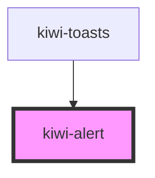

# kiwi-alert

<!-- Auto Generated Below -->

## Properties

| Property | Attribute | Description            | Type                                       | Default  |
| -------- | --------- | ---------------------- | ------------------------------------------ | -------- |
| `type`   | `type`    | The type of the alert. | `"error" \| "info" \| "success" \| "warn"` | `'info'` |

## Dependencies

### Used by

 - [kiwi-toasts](../kiwi-toasts)

### Graph

----------------------------------------------

*Built with [StencilJS](https://stenciljs.com/)*
