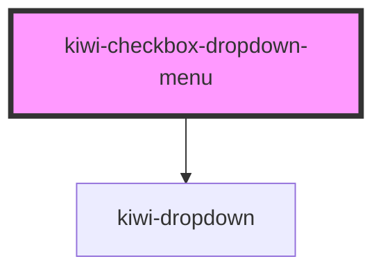

# kiwi-checkbox-dropdown-menu

<!-- Auto Generated Below -->

## Properties

| Property           | Attribute            | Description                | Type                                                        | Default     |
| ------------------ | -------------------- | -------------------------- | ----------------------------------------------------------- | ----------- |
| `toggleButtonType` | `toggle-button-type` | Type of the toggle button. | `"danger" \| "default" \| "info" \| "primary" \| "warning"` | `'default'` |

## Events

| Event           | Description                                    | Type                |
| --------------- | ---------------------------------------------- | ------------------- |
| `closeDropdown` | Event signaling that this dropdown was closed. | `CustomEvent<void>` |

## Dependencies

### Depends on

- [kiwi-dropdown](../kiwi-dropdown)

### Graph

----------------------------------------------

*Built with [StencilJS](https://stenciljs.com/)*
