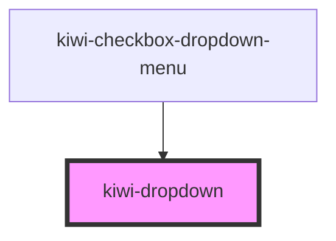

# kiwi-dropdown

<!-- Auto Generated Below -->

## Properties

| Property                      | Attribute            | Description                           | Type                                                        | Default     |
| ----------------------------- | -------------------- | ------------------------------------- | ----------------------------------------------------------- | ----------- |
| `containerClass` _(required)_ | `container-class`    | Css class to be applied to container. | `string`                                                    | `undefined` |
| `toggleButtonType`            | `toggle-button-type` | Type of the toggle button.            | `"danger" \| "default" \| "info" \| "primary" \| "warning"` | `'default'` |

## Events

| Event           | Description                                    | Type                |
| --------------- | ---------------------------------------------- | ------------------- |
| `closeDropdown` | Event signaling this dropdown is being closed. | `CustomEvent<void>` |

## Dependencies

### Used by

 - [kiwi-checkbox-dropdown-menu](../kiwi-checkbox-dropdown-menu)

### Graph

----------------------------------------------

*Built with [StencilJS](https://stenciljs.com/)*
