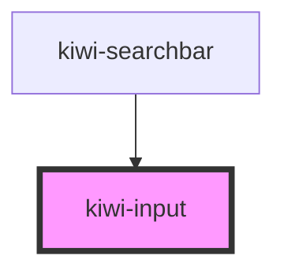

# kiwi-input

<!-- Auto Generated Below -->

## Properties

| Property      | Attribute     | Description                                                           | Type                  | Default     |
| ------------- | ------------- | --------------------------------------------------------------------- | --------------------- | ----------- |
| `name`        | `name`        | The _name_ attribute of the underlying input.                         | `string \| undefined` | `undefined` |
| `placeholder` | `placeholder` | The _placeholder_ attribute of the underlying input. Default _empty_. | `string`              | `''`        |
| `value`       | `value`       | The _value_ attribute of the underlying input. Default _empty_.       | `string`              | `''`        |

## Dependencies

### Used by

 - [kiwi-searchbar](../kiwi-searchbar)

### Graph

----------------------------------------------

*Built with [StencilJS](https://stenciljs.com/)*
