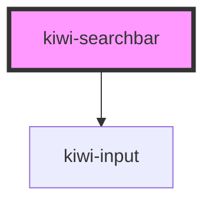

# kiwi-searchbar

<!-- Auto Generated Below -->

## Properties

| Property      | Attribute     | Description                                                                     | Type     | Default |
| ------------- | ------------- | ------------------------------------------------------------------------------- | -------- | ------- |
| `debounce`    | `debounce`    | The debounce time for the `triggerSearch` event in milliseconds. Default: `400` | `number` | `400`   |
| `placeholder` | `placeholder` | The placeholder to use for the search input.                                    | `string` | `''`    |
| `value`       | `value`       | The input value                                                                 | `string` | `''`    |

## Events

| Event           | Description                                                                                                | Type                  |
| --------------- | ---------------------------------------------------------------------------------------------------------- | --------------------- |
| `triggerSearch` | Event containing the search query. Fired after `debounce` time, either on type, or on click (immediately). | `CustomEvent<string>` |

## Dependencies

### Depends on

- [kiwi-input](../kiwi-input)

### Graph

----------------------------------------------

*Built with [StencilJS](https://stenciljs.com/)*
