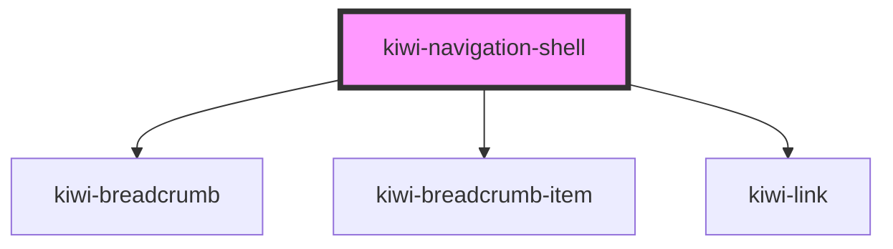

# kiwi-navigation-shell

<!-- Auto Generated Below -->

## Properties

| Property              | Attribute | Description | Type                                                                                                                | Default       |
| --------------------- | --------- | ----------- | ------------------------------------------------------------------------------------------------------------------- | ------------- |
| `layout`              | `layout`  |             | `"combined" \| "separated"`                                                                                         | `'separated'` |
| `routes` _(required)_ | --        |             | `{ routeKey: string; label: string; urlFactory: (data?: any) => string; handler: (data?: any) => RouteHistory; }[]` | `undefined`   |

## Dependencies

### Depends on

- [kiwi-breadcrumb](../kiwi-breadcrumb)
- [kiwi-breadcrumb-item](../kiwi-breadcrumb-item)
- [kiwi-link](../kiwi-link)

### Graph

----------------------------------------------

*Built with [StencilJS](https://stenciljs.com/)*
