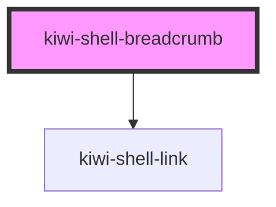

# kiwi-shell-breadcrumb

Renders a breadcrumb based on the current route history.

See the [Navigation Shell Example](../kiwi-navigation-shell/readme.md) for how to manipulate the breadcrumb.

<!-- Auto Generated Below -->

## Dependencies

### Depends on

- [kiwi-shell-link](../kiwi-shell-link)

### Graph

----------------------------------------------

*Built with [StencilJS](https://stenciljs.com/)*
