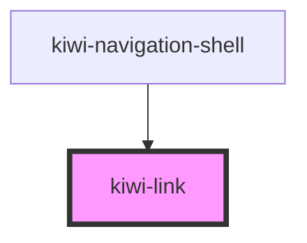

# kiwi-link

<!-- Auto Generated Below -->

## Properties

| Property                | Attribute    | Description | Type     | Default     |
| ----------------------- | ------------ | ----------- | -------- | ----------- |
| `routeData`             | `route-data` |             | `any`    | `undefined` |
| `routeKey` _(required)_ | `route-key`  |             | `string` | `undefined` |

## Dependencies

### Used by

 - [kiwi-navigation-shell](../kiwi-navigation-shell)

### Graph

----------------------------------------------

*Built with [StencilJS](https://stenciljs.com/)*
