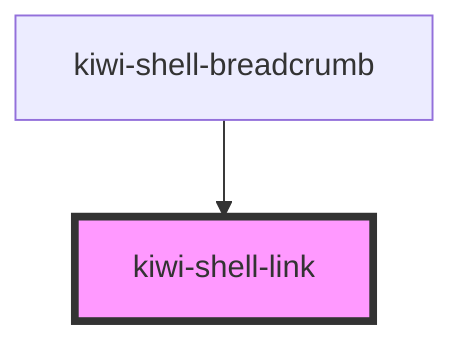

# kiwi-link

<!-- Auto Generated Below -->

## Properties

| Property                | Attribute      | Description                                                                                                                                                                                 | Type                        | Default     |
| ----------------------- | -------------- | ------------------------------------------------------------------------------------------------------------------------------------------------------------------------------------------- | --------------------------- | ----------- |
| `activeClass`           | `active-class` | If set to true will append class 'active' to the `a` element. Alternatively provide a string which is used as active class instead. When set to false, no class will be attached (default). | `boolean \| string`         | `false`     |
| `customClass`           | `custom-class` | Additional css to be applied to the underlying `a` element.                                                                                                                                 | `string \| undefined`       | `undefined` |
| `routeData`             | --             | Data associated to this route.                                                                                                                                                              | `{ [x: string]: unknown; }` | `{}`        |
| `routeKey` _(required)_ | `route-key`    | The key of the route config this link should be built off of.                                                                                                                               | `string`                    | `undefined` |

## Dependencies

### Used by

 - [kiwi-shell-breadcrumb](../kiwi-shell-breadcrumb)

### Graph

----------------------------------------------

*Built with [StencilJS](https://stenciljs.com/)*
